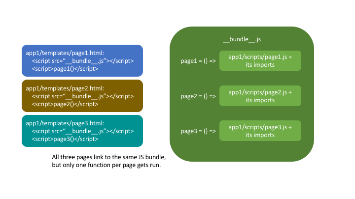

Webpack
================

As you know, DMP automatically creates links for your static files.  When you render ``app/templates/mypage.html``, DMP creates a script tag for ``app/scripts/mypage.js`` and a style tag for ``app/styles/mypage.css``.  This is the default configuration.

Today's production sites generally bundle scripts, styles, and other static assets into combined, optimized files that improve speed and enable better browser caching.  DMP comes with support for bundling with `Webpack <https://webpack.js.org/>`_.

These bundles can be created in at least two ways:

1. A bundle for each app.  If you have four DMP apps, you'll have four bundles.  This approach is described below.
2. A single bundle for your entire site.  If you have four DMP apps, you'll have one bundle.  This approach is described near the end of this document.

Creating Bundles
---------------------------------

Lots of different Javascript files exist in a project.  Some are project-wide, such as ``jQuery``.  Some are full apps, such as ``React`` or ``Vue`` apps.  These generally get bundled in their own ways and don't need DMP's involvement.

DMP-style scripts are coupled with their templates.  They aren't generally self-contained "apps" but add behavior to their templates (although they might start React apps or other components).  When ``mypage.html`` displays, we need ``mypage.js`` to run.

Herein lies the issue that this provider solves: if we bundle several of these scripts together--such as all the scripts in an app--loading the bundle into a page will run not only ``mypage.js``, but also ``otherpage.js`` and ``otherpage2.js``.  Since the bundle contains scripts for many pages, we need to selectively run a small part of the bundle.

This provider wraps each script inside a function inside the larger bundle.  Since the bundle is a map of template names to functions, the page scripts load but don't run. DMP manually triggers the right ones for the current template.

Tutorial
---------------------------------

Let's create a "normal" Django/DMP project and then convert it to a "bundle-endabled" Django/DMP project.

    A note before continuing: JS bundling can be difficult for Python developers at first because it's based in fundamentally different thinking than the Python world is. Python compiles .py files to .pyc, but otherwise keeps the source structure at runtime. Bundling requires setting up npm, ``node_modules``, and multiple config files. As of 2018, Javascript's import landscape is a battleground of similar-looking but quite different standards and libraries: <script src=>, jQuery plugins, CommonJS,AMD, RequireJS, npm, yarn, ES6 import standards, and dynamic imports. For Python devs who are used to a benevolent dictator solving divisive issues (like Guido did with the ``m if x else n`` debate), the chaotic and evolving JS ecosystem can be overwhelming. If you are new to bundling, take the time to read the documentation on ``npm`` and ``webpack`` and create a small Node JS web site.

Create a DMP project
~~~~~~~~~~~~~~~~~~~~~~~~

The installation steps for DMP are given elsewhere in these documents, so `take a detour if you need detailed instructions </install_new.html>`_. Here's a review for those need a quick summary:

::

    pip3 install --upgrade django-mako-plus
    python3 -m django_mako_plus dmp_startproject mysite
    cd mysite
    python3 manage.py migrate
    python3 manage.py createsuperuser
    python3 manage.py dmp_startapp homepage
    # Finally, open settings.py and add "homepage" to your INSTALLED_APPS

Run your project, and ensure the "Welcome to DMP" page comes up. If not, head over to the DMP installation pages for ideas.

Note that your new project already contains ``homepage/scripts/index.js``. Let's add another script file so we can see the bundling work:

.. code-block:: javascript

    // homepage/scripts/base.js:
    (function(context) {
        console.log('In base.js!')
    })(DMP_CONTEXT.get());

You should now have two JS files: ``index.js`` and ``base.js``. Since template ``index.html`` extends template ``base.html``, both JS files should run when we view ``index.html``. Refresh your project home page and check the JS console (right-click the page, then Inspect Element) for the output of both scripts.

Initialize Node
~~~~~~~~~~~~~~~~~~~~~~~~~~

Install Node from `https://nodejs.org <https://nodejs.org/>`_. After installation, open a terminal and ensure you can run ``npm`` from the command line.

::

    npm --version

Initialize the npm repository and install webpack. When asked, just accept the defaults for package name, version, etc.

::

    cd mysite/
    npm init
    npm install --save-dev webpack webpack-cli style-loader css-loader glob
    # if using git, add "node_modules/" and ".cache" to your .gitignore file

The above commands changed your project a little:

1. The ``node_modules`` directory exists in your project root and contains dozens of Javascript packages, including core Node packages and webpack-related dependencies. This directory is the Javascript equivalent to ``pip3``, a virtual environment, and python site-packages. This directory can be recreated anytime by running ``npm install``.
2. The ``package.json`` file in your project root contains a list of npm package dependencies. If you open the file, you'll notice that ``webpack`` is listed as a development dependency (it isn't needed at production, so it's in "devDependencies").

Let's create some shortcut comands to make running webpack easier. These are defined in ``package.json`` under the ``scripts`` key, like this:

.. code-block:: javascript

    {
        ...,
        "scripts": {
            "watch": "webpack --mode development --watch",
            "build": "webpack --mode production"
        }
    }

The above two scripts can be run with ``npm run watch`` and ``npm run build``, but we're not quite ready to run them yet. So hold up, Tex.

Create the Entry File
~~~~~~~~~~~~~~~~~~~~~~~~~~~~~~~~~~~~~~~~~

Webpack requires one or more "entry" files as starting points for its bundles. In Node applications and single-page webapps, a "main" JS file runs everything. Multi-page, Django-style web sites are different: each page is essentially an "app" that requires a new bundle.

That means our Django/DMP projects have **lots of entry points**: the login page, password change page, user information page, and so forth. We don't really have an "entry" page to point webpack at.

That's where DMP comes in. DMP understands your project structure, including how ``templates``, ``scripts``, and ``styles`` directories are connected. DMP will create ``homepage/scripts/__entry__.js`` as the "entry" file for our ``homepage`` app.

Run the following to create the ``__entry__.js`` file:

::

    python3 manage.py dmp_webpack --overwrite

When the command finishes, you'll have a new file, ``homepage/scripts/__entry__.js``, that points to the scripts and styles in the app. Check out the file to see what DMP created.

Now that you've seen the result, let's detail the discovery process that just occurred:

--------

**1. DMP deep searched the templates directory ``homepage/templates/`` for all files (except those starting with double-underscores, like ``__dmpcache__``.** DMP found three files:

::

    homepage/templates/base_ajax.htm
    homepage/templates/base.htm
    homepage/templates/index.html

--------

**2. DMP loaded each file as a template object (as if it were about to be rendered) and ran its `Providers </static_providers.html>`_, ``CssLinkProvider`` and ``JsLinkProvider``.**  These two providers are the defaults, but you can `customize them in settings.py </basics_settings.html>`_ (see ``WEBPACK_PROVIDERS``).

Now, providers are built to discover the script and style files that are associated with templates, so DMP used them to find the files needed for our bundle:

::

    homepage/templates/base_ajax.htm    # has no scripts or styles, so DMP skips it
    homepage/templates/base.htm         # DMP finds base.js and base.css
    homepage/templates/index.html       # DMP finds index.js and index.css

The providers yielded four files, shown here as a list relative to the entry file path:

.. code-block:: python

    [ "./base.js", "../styles/base.css", "./index.js", "../styles/index.css" ]

--------

**3. DMP created ``homepage/scripts/__entry__.js``, which we'll use later as Webpack's entry point.** This file contains a number of Node ``require`` statements surrounded by function closures:

.. code-block:: javascript

    (context => {
        DMP_CONTEXT.linkBundleFunction("homepage/index", () => {
            require("./../styles/index.css");
            require("./index.js");
        })
        DMP_CONTEXT.linkBundleFunction("homepage/base", () => {
            require("./../styles/base.css");
            require("./base.js");
        })
    })(DMP_CONTEXT.get());

Configure and Run Webpack
~~~~~~~~~~~~~~~~~~~~~~~~~~~~~~~~~~~~~~~~~

We need to tell webpack to start with our entry file. Create a file in your project root called ``webpack.config.js``:

.. code-block:: javascript

    const path = require('path');
    const glob = require('glob');

    // map the entry files: { app: entry file, ... }
    const entries = glob.sync("./*/scripts/__entry__.js").reduce((acc, fp) => {
        acc[fp.split(path.sep)[1]] = fp;
        return acc;
    }, {});

    // print our findings (just for this tutorial)
    console.log(entries);

    // webpack config
    module.exports = {
        entry: entries,
        output: {
            path: path.resolve(__dirname),
            filename: '[name]/scripts/__bundle__.js'
        },
        module: {
            rules: [{
                test: /\.css$/,
                use: [
                    { loader: 'style-loader' },
                    { loader: 'css-loader' }
                ]
            }]
        }
    };

Thanks to the magic of globs, the above config finds all entry files in your project.

    You can set the destination to be anywhere you want (such as a ``dist/`` folder), but it's just fine to put them right in your ``app/scripts/`` folder.  DMP only puts **template-related** scripts into ``__entry__.js``, so you won't get infinite bundling recursion by putting the bundle in the same directory. If you decide to change the location, be sure to modify the `provider filepath settings </basics_settings.html>`_ to match.

Let's run webpack in development (watch) mode. After creating our initial bundle, webpack continues watching the linked files for changes. Whenever we change the entry file, script files, or style files, webpack recreates the bundle automatically. Run the following:

::

    npm run watch

Assuming webpack runs successfully, you now have ``homepage/scripts/__bundle__.js``. If you open it up, you'll find our JS near the end of the file.

Living in Two Terminals
~~~~~~~~~~~~~~~~~~~~~~~~~~~~~~~

Now that you're using bundles, you need TWO terminals running during development. The following should be running in their own terminal windows:

1. ``python3 manage.py runserver`` is your normal Django web server.
2. ``npm run watch`` recreates bundles you modify the support files.

Bundle Links in Templates
~~~~~~~~~~~~~~~~~~~~~~~~~~~~~~~~~~~~~~~~

As you learned in other sections, DMP automatically creates ``<script>`` and ``<style>`` links in your html templates. In our project, this happens in ``base.htm``, during the call to ``${ django_mako_plus.links(self) }``. By default, DMP uses *Providers* to generate old-style script and style tags directly to the respective files.

We need swap the default Providers with bundle-basd Providers link to ``homepage/scripts/__bundle__.js``. This is done by setting ``CONTENT_PROVIDERS`` in ``settings.py``:

::

    TEMPLATES = [
        {
            'NAME': 'django_mako_plus',
            'BACKEND': 'django_mako_plus.MakoTemplates',
            'OPTIONS': {
                # providers - these provide the <link> and <script> tags that the webpack providers make
                'CONTENT_PROVIDERS': [
                    { 'provider': 'django_mako_plus.JsContextProvider' },
                    { 'provider': 'django_mako_plus.WebpackJsLinkProvider' },
                ],
            }
        }
    ]

These new Providers give the following behavior:

1. ``JsContextProvider`` is the same as before. `It sets values from the view into the JS context </static_context.html>`_.
2. ``WebpackJsLinkProider`` creates the link for the bundle: ``<script src="/static/homepage/scripts/__bundle__.js">`` and calls the bundle functions for the current template.
3. If you prefer to bundle CSS and JS separately, enable code splitting in webpack's config and add ``django_mako_plus.WebpackCssLinkProvider`` to the content providers list. This tutorial puts everything in the JS bundle for simplicity.

Test It!
~~~~~~~~~~~~~~~~

We've configured webpack, created the entry file and output bundle, and set DMP to link correctly. The only thing remaining is to run the Django server and see the benefits of your work!

::

    # in terminal 1:
    npm run watch

::

    # in terminal 2:
    python3 manage.py runserver

Grab some popcorn and a drink, and take your browser to ``http://localhost:8000/``. Be sure to check the following:

* Right-click and Inspect to view the JS console. The messages in our .js files and/or any errors will show there.
* Also in the inspector, check out the CSS rules (which are now coming from the bundle).
* Right-click and view the page source. You'll see the links that DMP created. If you see the old ``<script>`` and ``<style>`` links, check your settings file.

Building for Production
---------------------------

To create a production bundle, issue webpack a build command:

::

    npm run build

If you look at the generated bundle file, you'll find it is minified and ready for deployment.

Further Questions?
-----------------------

The `DMP Webpack FAQ </static_webpack_faq.html>`_ goes over several different situations.
